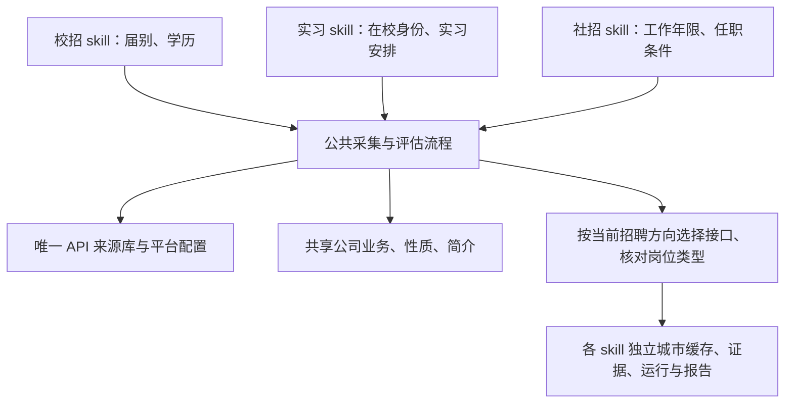

# 求职 Skill 共享架构

校招、实习、社招使用一个来源库和一套采集、归档、批次、报告实现。三个入口分别选择业务方向，并将个人输入和运行产物写入自己的目录。原有 CLI 命令保持兼容。



| 内容 | 唯一维护位置／保存规则 |
| --- | --- |
| 公司与 API 配置 | `shared/job-search-core/assets/sources.json` |
| 自建接口配置、相关许可证 | `shared/job-search-core/assets/` |
| 公司业务、性质、简介 | `shared/job-search-core/data/` |
| 公司规模、逐配置逐方向的搜索能力 | 同一共享 data，保留模型版本、证据及未核实原因 |
| 接口健康、失败冷却、修复记录 | 本地 `shared/job-search-core/state/`；已验证契约和历史写回唯一 sources.json |
| 采集器、来源方向路由、正文检查、批次、Excel | `shared/job-search-core/scripts/lib/` |
| 公共 CLI 与简历提取 | `shared/job-search-core/scripts/` |
| 招聘方向 | 各 skill 的 `assets/search-mode.json`，入口同时校验方向 |
| 业务流程及资格评估约定 | 各 skill 的 `SKILL.md`、`references/`；公共校验器根据当前方向执行对应规则 |
| 城市索引、方向核验、画像、运行、报告 | 各 skill 独立保存，不跨方向复用 |

来源共享指共享公司的入口及接口契约。实际调用仍按校招／实习／社招选择招聘站点、参数或接口，再核对返回岗位；不能把同一个校招查询直接当成社招查询。全部配置保持启用；证据分为已取得目标 JD、已确认对应检索接口、仍待核实。请求失败与空列表分别记录。

## 维护一次，三个入口生效

新增或修复来源直接修改共享库，修复平台采集代码直接修改共享实现。运行时始终读取共享库，不依赖复制、构建或派生摘要。旧 `scripts/lib/*.mjs` 只保留两行兼容导出，供历史脚本和测试使用，不在其中实现业务。

`node internet-campus-job-fit/scripts/build-recruitment-variants.mjs` 现在只刷新三个 skill 的来源摘要和方向路由索引，不再复制来源、代码或覆盖 skill 文档。`data/shared-registry.json` 是可重新生成的摘要，不能当作第二份库存。`data/registry-inheritance.json` 保留迁移前的历史记录，不表示当前库存。

已有来源维护脚本已改用 `registry.mjs` 的 `datasetPath`；城市及历史证据文件仍留在原 skill。新增脚本使用 `readSourceRegistry()` 或导出的共享文件路径，不创建 skill 私有的 `assets/sources.json`。历史 artifacts 中的库存快照保留原样。

方向核验按完整配置键匹配：新增、变更配置自动启用，但不能借用旧配置的证明。运行时直接计算当前证据状态，因此没有刷新摘要也不会漏掉新增来源。历史已测试数量与当前启用数量分别报告。

## 运行隔离和部署

一个 Node 进程或 Worker 使用一个招聘方向，初始化后禁止切换。CLI 通过 `launcher.mjs` 明确设置业务上下文；旧维护脚本按入口所在 skill 解析上下文。自行编写的外部脚本应先 `configureRuntime({mode:'internship'})` 再动态导入运行库；方向审计 Worker 使用 `JOB_FIT_SKILL_ROOT` 明确指定上下文。

城市索引、匿名站点发现缓存、原始 API 响应、JD 快照、评级和输出均写回当前 skill。来源指纹包含方向及规则版本；不复用其他方向的采集或评级。`--run` 会检查目录边界和运行方向。共享公司事实会在 prepare 时生成运行快照，历史报告不随资料库更新而悄悄变化。

部署时保留仓库相对布局：三个 skill 依赖同级 `shared/job-search-core`，不再支持只复制一个 skill 文件夹。无需符号链接或安装新服务。旧命令如 `node internship-job-fit/scripts/jobs.mjs industries` 不变。

定向检索是独立于招聘方向的检索模式。`search_mode` 仍表示 campus／internship／social，运行的 `retrieval_mode` 表示 exhaustive／targeted。计划、公司集合、标题词和检索规则有独立指纹；定向快照不用于全量缓存或城市索引。普通接口和定向接口调用复用同一适配器。

城市索引仅保留统计、覆盖限制和每城至多两条例证，全部响应与观察岗位留在对应 artifacts；部分结果与失败不清空历史地点。自修复只有验证通过才写共享源，使用锁、旧配置比较及原子更新，避免多个 skill 同时覆盖来源。

本轮产品约定见 [PRD](PRD.md)，可用命令与维护边界见 [共享维护](shared/job-search-core/references/maintenance.md)。

## 验证

从仓库根目录执行：

```powershell
node --test internet-campus-job-fit/scripts/tests/*.test.mjs
node internet-campus-job-fit/scripts/verify-direction-delivery.mjs
```

第一项包含平台契约、资格规则、采集覆盖、评估、报告及共享架构回归；第二项重新核对已保存的方向 API 证据并检查缓存续跑。它们不能证明所有远端接口此刻仍在线。真实联网逐配置复测使用原方向审计命令，并分别保存实习／社招证据。
