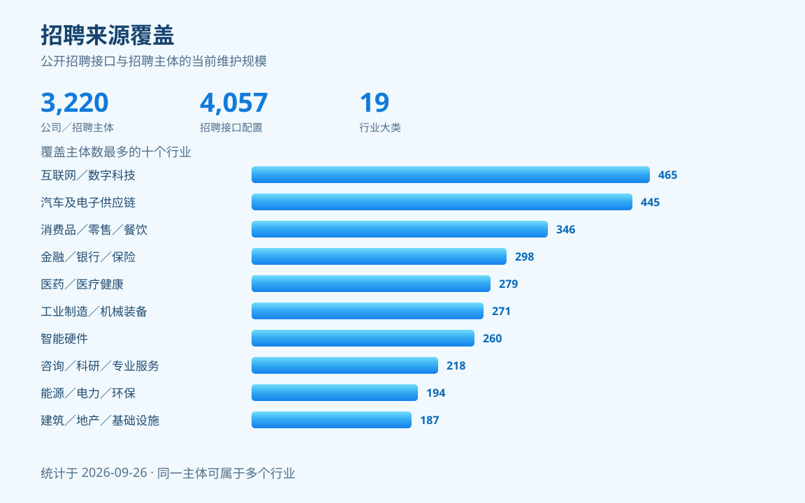

<p align="center">
  
</p>
<p align="center">
  <strong>用自然语言找岗位、判断匹配度、持续关注新机会。</strong>
</p>
<p align="center">
  <a href="LICENSE"></a>
</p>

## 安装

复制下面这段话，发给支持本地 Skill 和命令执行的 Agent：

```text
请安装 JobScope_CN 求职技能包：
https://github.com/CJlovetypo/job-search-skill-pack

完整保留仓库目录，按 README 的“手动安装与运行依赖”检查环境。
加载 job-search、job-radar 和 recruitment-link-repair 的 SKILL.md，求职使用 job-search。
```

<details>
<summary>手动安装与运行依赖</summary>

将整个仓库放入支持本地 Skill 和命令执行的 Agent 工作环境，并让宿主加载 `job-search`、`job-radar` 和 `recruitment-link-repair` 的 `SKILL.md`。校招、实习、社招统一使用 `job-search`。当前 Excel 导出使用 Codex 的运行依赖；其他宿主需提供兼容依赖后使用。

```sh
git clone https://github.com/CJlovetypo/job-search-skill-pack.git JobScope_CN
cd JobScope_CN
```

请保留完整相对目录。求职入口依赖共享核心与方向运行目录，单独复制某个 Skill 无法运行。

```text
JobScope_CN/
  job-search/              # 统一意图判断、任务记录和执行入口
    runtime/              # 内部规则、数据和维护工具，不是独立 Skill
      campus/             # 正式校招
      internship/         # 实习
      social/             # 社招
  job-radar/               # 岗位订阅与变化跟踪
  recruitment-link-repair/ # 招聘入口历史定位与修复
  shared/job-search-core/  # 共用业务判断、证据模型、来源采集与交付
  datasets/                # 本地维护资料：不随 GitHub 分发
  docs/                    # 本地 PRD、审核和过程报告：不分发
  README.md
```

| 依赖 | 用途 |
| --- | --- |
| Node.js 22+ | 岗位采集与校验；岗位雷达需 **22.13+**，使用内置 SQLite；可选 Perplexity 联网回答需安装官方 npm SDK |
| Python 3 | 简历提取与少量公开 API；PDF 提取需要 `pypdf`，可用 `CAMPUS_JOB_FIT_PYTHON` 指定解释器 |
| `@oai/artifact-tool` | Excel 导出；通过 Codex 的 `load_workspace_dependencies` 定位，或设置 `CODEX_NODE_MODULES` |
| 宿主定时任务 | 岗位雷达的每日检索与提醒 |

</details>

## 项目介绍

**接入 3,220 个公司／招聘主体，用自然语言找岗位、判断匹配度、持续关注新机会。**

JobScope_CN 是面向中文求职场景的 AI Agent 技能包。通过 [job-search 统一入口](job-search/SKILL.md)，用自然语言浏览岗位、结合经历判断匹配度，或比较已有机会。它从公司公开招聘接口采集岗位，阅读完整职位描述（JD），按实际证据解释匹配依据与待确认事项；需要持续关注时，再衔接岗位雷达。

**先看机会可以不交简历，具体文字经历也能用于匹配。** 已经说了“校招”“实习”或“社招”，就沿用该方向；只补问当前阶段必要的信息。没有指定城市时，本轮不加城市过滤，并保留“未指定”状态。开展岗位搜索前，需要确定行业或明确公司范围；已有 JD 可直接比较。三个招聘方向由统一入口加载各自规则，共用业务决策与判断模型，运行数据按方向隔离。

缺少经历证据时保留“不确定”，不直接判不匹配；工作年限记录实际差距，再结合职责与成果判断是否有放宽依据。报告单列城市意愿、薪资参考和证据充分性，具体规则见下方报告说明与[能力证据模型](job-search/runtime/campus/references/ability-model.md)。

> “使用 job-search，先找上海互联网行业的校招项目管理岗位，不做个人匹配。等我补充项目经历后，再评估其中 20 个。”

## 从三千余个招聘主体中，找到值得认真看的机会

找工作往往要反复切换公司招聘网站，筛掉不符合条件的岗位，再逐条对照自己的经历。本项目把这段工作接起来：**公司招聘源采集 → 按求职阶段筛选 → 完整 JD 评估 → 岗位变化跟踪**。

| 你关心的事 | 这里怎么做 |
| --- | --- |
| 能找到多少公司的岗位？ | 维护覆盖 **3,220 个公司／招聘主体、19 个行业大类**的共享来源库，包含 **4,057 个招聘接口配置**。 |
| 能不能按我的情况找？ | 校招核对届别、学历与专业；实习核对在校状态与到岗安排；社招结合实际职责、成果及经验差距判断。 |
| 没有简历能开始吗？ | 可以先发现岗位；做匹配时已有文字事实也可使用，缺少的证据保留为不确定。 |
| 推荐理由是什么？ | 在选定范围内逐岗阅读完整 JD，分别判断“我能否胜任”和“这份工作是否符合我的意愿”，保留依据与缺口。 |
| 想换城市、行业或评估范围怎么办？ | 直接在对话里调整要求，可以先看指定公司、先评估一批，或评估已确认范围内的全部岗位。 |
| 不想每天重新搜一遍？ | 用岗位雷达订阅关注条件，由宿主定时检索，提醒首次发现、信息更新和重新出现的岗位。 |

## 招聘来源覆盖



统计于 **2026-09-26**，依据仓库当前 [招聘来源库](shared/job-search-core/assets/sources.json)。来源库快照更新时间为 2026-09-22。

### 行业覆盖一览

| 行业 | 公司／招聘主体数 | 已收录主体举例 |
| --- | ---: | --- |
| 互联网／数字科技 | 465 | 阿里巴巴、百度、哔哩哔哩 |
| 汽车及电子供应链 | 445 | 艾为电子、安波福、安徽康明斯 |
| 消费品／零售／餐饮 | 346 | 安踏集团、澳优乳业、白象食品 |
| 智能硬件 | 260 | 埃斯顿、安克创新、奥比中光 |
| 金融／银行／保险 | 298 | 北京银行、博时基金、财通证券 |
| 工业制造／机械装备 | 271 | 阿特拉斯·科普柯中国、奥特维、北方华创 |
| 医药／医疗健康 | 279 | 阿斯利康中国、百济神州、拜耳 |
| 咨询／科研／专业服务 | 218 | 毕马威、大华会计师事务所、道远咨询 |
| 建筑／地产／基础设施 | 187 | 保利发展控股、北京城建集团、北京建工集团 |
| 能源／电力／环保 | 194 | 爱旭股份、安徽省能源集团(皖能集团)、白云电气集团 |
| 综合集团／投资运营 | 157 | 爱琴海集团、宝时得、北京稻香村 |
| 石化／材料／矿冶 | 170 | 安美集团、巴德富、藏格矿业集团 |
| 交通物流／贸易 | 123 | 德邦快递、广州地铁集团、广州公交集团 |
| 航空航天／船舶／轨道装备 | 89 | 昂际航电、东方空间、峰飞航空 |
| 文化传媒／旅游 | 91 | 奥飞娱乐、北京环球度假区、电子工业出版社 |
| 整车厂 | 85 | 阿维塔科技、比亚迪、大众汽车集团中国 |
| 农林牧渔 | 45 | 大北农集团、海大集团、华润五丰 |
| 通信／运营商 | 78 | 鼎桥技术、烽火通信、广和通 |
| 教育／培训 | 34 | 爱学习、昂立教育、高途 |

查看 [完整公司名单与招聘入口](job-search/runtime/campus/data/行业公司索引.md)。行业按公司业务划分，研发、产品、设计、销售、HR、财务等不同职能均可纳入。

<details>
<summary>统计口径与采集能力</summary>

- **主体数**按来源库中的 `company_id` 去重，不等于去重后的企业集团数。同一公司／招聘主体可以属于多个行业，因此行业行数不能直接相加作为总数。
- **接口配置数**按各主体的 `recruitment_sources` 统计；没有子配置时按主体自身配置计 1 个。同一主体可能有多个招聘入口，配置数不是岗位数。
- **接入方式**包括北森、Moka、海纳 Hotjob、飞书招聘，以及 Workday、SmartRecruiters、Oracle 等招聘系统和公司自有接口。通过公开接口及匿名初始化获取岗位，无需用户登录招聘平台。完整 JD、零岗位 API、完整公开列表与动态列表契约分开标注；列表契约只证明公司入口和匿名列表端点可用，不承诺单次快照取全。Jobs2Web、AJINGA 本轮只核验列表，缺正文的岗位不进入完整评估。SAP 的官方 RSS 属于明确标注的部分覆盖来源。
- **来源证据**保留请求样例、岗位样本、核验日期与分页限制。曾经验证可取得 JD，不代表接口始终在线，也不代表该主体此刻同时开放校招、实习和社招。
- **候选目录不计入接入量**。Waiqi 等渠道发现的公司与招聘链接须经过接口和主体核验，纳入正式来源库后才计数；维护方法见 [Waiqi 来源维护](shared/job-search-core/references/waiqi-sources.md)。

在仓库根目录运行 `node job-search/scripts/jobs.mjs industries` 可查看当前行业计数。上方图表与表格是本次统计快照，新增来源后应同步更新。

</details>

## 从统一入口开始，按招聘方向判断

统一入口负责理解需求、必要补问、搜索策略与评估范围；共享核心维护业务判断、招聘采集、公司标签、证据匹配与报告。校招、实习、社招使用各自的差异规则，运行记录和城市缓存按方向隔离。正式校招中的提前实习要求、普通实习与社招会分别识别，类型不明确的岗位保留为待核实。

| 你的需求 | 入口／方向 | 重点判断 | 交付 |
| --- | --- | --- | --- |
| 先找机会、匹配或比较岗位 | [job-search](job-search/SKILL.md)，推荐入口 | 用户意图、已知条件、必要补问与本轮范围 | 候选 Markdown/JSON，或按方向输出匹配 Excel |
| 应届生找正式工作 | [job-search · 校招](job-search/SKILL.md) | 毕业届别、学历、专业、项目与实习经历 | 校招岗位匹配 Excel |
| 在校生找实习 | [job-search · 实习](job-search/SKILL.md) | 在校状态、开始日期、每周到岗天数、持续月数 | 实习岗位匹配 Excel |
| 明确走社招，包括零正式工作年限 | [job-search · 社招](job-search/SKILL.md) | 学历、专业、实际职责与成果、年限差距及必要资格 | 社招岗位匹配 Excel |
| 持续关注某类机会 | [job-radar](job-radar/SKILL.md) | 岗位方向、行业或公司、城市、招聘类型 | 岗位变化 Markdown 日报 |

### 用自然语言开始，随时调整要求

安装并由宿主加载 Skill 后，用中文描述目标即可；也可以点名对应 Skill。你不需要编写查询参数、编辑 JSON 或手动执行采集命令。

当你表达岗位倾向但尚未选择搜索方式时，Agent 会先说明取舍：标题定向通常更快，但可能遗漏标题不同的相关岗位；全量 JD 综合判断覆盖更充分，但耗时更长。确认定向后，已验证支持关键词的数据 API 先搜索再返回，其余来源完整获取列表后在本地筛选。选择全量时结合标题和 JD 正文判断相关性。

**先看岗位，不做个人匹配：**

> 使用 job-search，找上海互联网和智能硬件行业的校招项目管理岗位。先给我候选清单和官方链接，我暂时不提供简历。

**结合经历匹配校招：**

> 使用 job-search。我是 2027 届机械工程硕士，想找上海智能硬件公司的项目管理校招岗。做过四人课题组的试验排期和进度跟踪，没有量产项目经验。先完整评估 20 个岗位，输出 Excel，缺少依据的部分标不确定。

**找实习：**

> 使用 job-search，找上海互联网公司的产品运营实习。我是 2028 届在校本科生，2026 年 10 月开始，每周能到岗四天，可以持续六个月。下面是我的项目经历，先评估 10 个岗位。

**找社招：**

> 使用 job-search，找社招。我有三年销售经验，想找房地产销售相关工作。请使用快速定向模式，先说明候选公司和岗位标题关键词，再读取命中岗位的完整 JD。

**继续调整：**

> 城市加上杭州，先评估我指定的这几家公司。
>
> 我更在意业务方向，请把能力匹配和求职意愿分开说明。
>
> 这次先评估 20 个岗位，输出 Excel；下一批继续沿用我的要求。

已明确的条件直接沿用。用户已给评估数量、指定公司或全量范围时不重复询问；未给时，取得候选数量后再确定。补问按任务聚合，每轮最多三组。调整条件后，按新范围补采或重评，保留原报告。

默认遍历入选来源的全部可访问岗位。希望更快得到结果时，可以明确选择“快速定向模式”：先缩小候选公司和岗位标题范围，再对命中岗位做全文评估；报告会说明由此可能遗漏的机会。

## 拿到一份能用于决定下一步的报告

只看机会时，交付候选 Markdown/JSON，包含官方链接、招聘类型、地点和覆盖说明，并标明尚未进行个人匹配。

进入匹配后，每个岗位独立判断六个维度：**硬性条件、能力、工作内容意愿、城市意愿、薪资参考、证据充分性。** 新版 Excel 的两张岗位表均为 15 列，附具体理由、待补事实及 JD 链接。

| 主要判断 | 下一步建议 |
| --- | --- |
| 主要条件已有充分支持 | 可以投递 |
| 有真实匹配依据，但材料或迁移准备仍需补强 | 投递前准备 |
| 没有已证实的关键冲突，但关键个人事实不足 | 补资料后判断 |
| 已证实关键资格、核心能力或不可接受条件冲突 | 暂不建议投递 |

| Excel 工作表 | 你能看到什么 |
| --- | --- |
| 岗位匹配 | 六个判断维度、下一步建议、主要缺口和岗位链接；已阅读全文但缺少个人事实的岗位也保留在这里，标为不确定 |
| 待核实与未评估 | 招聘类型、开放状态、正文等资料仍待核实，或尚未完成审阅的岗位 |
| 公司简介 | 公司业务、性质、规模与资本资料，附资料日期和来源 |
| 来源覆盖 | 本次查了哪些来源、完成了多少评估、哪里采集失败或存在分页限制 |

能力判断依据实际经历与成果，意愿判断依据明确偏好；没有写过某项技能不等于不会。只缺城市的完整 JD 可以先判断其他维度，城市保留未知。已审阅但不确定是有效结果，不会因缺证反复重跑。

**年限、城市和薪资如何处理：**

- 工作年限作为经验参考，分别记录 JD 要求、本人总年限与相关经验。可结合实际职责、责任深度和成果判断放宽依据，不设统一“可少几年”，也不保证雇主接受。
- 地点仅匹配城市意愿；未指定、明确不限与岗位城市未知分别记录。同城远近、离家距离和通勤时长不支持，用户提出时会明确告知并忽略，不作为后续执行目标。
- JD 薪资可能不准确，仅作参考，不代表实际录用待遇，不提供薪资区间硬筛。只有口径可比时才比较，缺失或不可比保留未知；仅在主要判断相当时辅助排序，不改变主要档位或投递动作。

## 岗位雷达：让关注的机会定时送到你面前

找工作常常持续数周甚至数月。把关注条件交给 [job-radar](job-radar/SKILL.md)，就能定时检索，并保留每次看到的岗位与变化历史。**开启雷达不需要简历**，提供岗位方向、意向行业或公司中的至少一项即可，再确定招聘类型和执行时间。

> 使用 job-radar，关注上海游戏公司的社招项目经理岗位，每天北京时间上午 9 点检索，有新岗位或变化时告诉我。

> 改成同时关注上海和杭州，增加项目管理相关岗位。

> 暂停这条订阅，帮我回看最近发现的岗位。

雷达会先完成一次检索，再建立宿主定时任务。后续日报默认展示十条岗位变化及链接，完整记录保存在本地，可以回看历史。

| 变化 | 提醒内容 |
| --- | --- |
| 首次发现 | 这条订阅第一次收录的岗位；不等于岗位今天发布 |
| 信息更新 | JD、条件、地点、薪资等实质信息发生变化 |
| 重新出现 | 曾经未再检索到的岗位，本次再次出现 |
| 采集异常 | 哪些来源失败或未取全，方便判断本次覆盖情况 |

默认有新增、实质变化或采集失败才主动提醒；也可以要求每天收到日报。未再搜到的历史岗位标记为“本次未见”，不会直接判定已经下架。发现感兴趣的岗位后，可交给 job-search，结合简历或具体文字经历进一步评估。

**定时执行依赖宿主调度能力。** 只有宿主确认创建任务后，才算启用；单独安装 Skill 或运行 CLI 不会启动后台定时服务。详见 [岗位雷达运行约定](job-radar/references/operations.md)。

## 开发与运行验证

统一入口、任务修订及发现/匹配命令见 [任务契约](shared/job-search-core/references/task-contract.md)。岗位发现输出候选 Markdown/JSON 并明确尚未个人匹配；正式匹配继续交付 Excel。工程与正式数据的分发边界见 [工程管理](shared/job-search-core/references/repository-management.md)。

<details>
<summary>验证命令与测试记录</summary>

可选的 [Perplexity 联网回答](shared/job-search-core/references/perplexity-agent.md)用于主动公司研究，支持来源引用、结构化输出和多轮追问；通过环境变量认证，不会自动更新公司标签。

在仓库根目录执行：

```sh
node job-search/scripts/jobs.mjs industries
node --test job-search/runtime/campus/scripts/tests/*.test.mjs job-radar/scripts/tests/radar.test.mjs recruitment-link-repair/scripts/history.test.mjs
```

项目回归测试在 `shared/job-search-core` 运行 `npm test`，发布边界检查运行 `npm run check:distribution`。真实模拟回复、审核记录和过程报告保留在本地 `docs`，不随 GitHub 分发。

三个招聘方向通过统一 CLI 完成候选发现和 v5 匹配 Excel 链路；内部 runtime 目录不作为 Skill 加载。

更多说明：[运行与数据约定](job-search/runtime/campus/references/workflow.md) · [共享来源维护](shared/job-search-core/references/maintenance.md) · [定向检索](shared/job-search-core/references/targeted-search.md) · [公司规模模型](shared/job-search-core/references/company-size-model.md) · [接口修复](shared/job-search-core/references/source-repair.md)。第三方来源许可见 [job-pro-LICENSE.txt](shared/job-search-core/assets/job-pro-LICENSE.txt)。

</details>

## 覆盖与数据说明

“范围内审阅完成”指已读取并判断本次明确范围内的可评估岗位，不代表所有岗位的适合性都已确定，也不代表全市场覆盖。报告会同时说明已审阅数、仍不确定数及资料待核实情况。公司性质、行业、业务及招聘城市标签仅在主动维护流程更新；搜索与匹配直接使用已保存记录，缺项不触发补核，正常岗位采集不回写共享标签。已发布的公司静态标签可能处于 `api_supported`（API 有来源支持、待独立核实）或 `verified`（独立核实）状态，两者在画像中分开记录；国企／外企等性质倾向、行业与业务偏好读取正式画像。城市硬筛使用对应招聘方向已保存的地点标签，软偏好单独记录；尚未记录的城市可能影响入选范围。空列表、部分分页、待核实和采集失败分别记录，接口失败不解释为公司没有招聘。

简历、个人画像、报告、原始抓取记录和运行历史保存在本地，不随仓库分发。求职任务修订位于 `job-search/runs`；各招聘方向的运行产物位于 `job-search/runtime/<方向>/runs`、`outputs`、`artifacts` 等目录；雷达订阅与 SQLite 历史库位于 `job-radar/state`，均由 `.gitignore` 排除。使用时，Agent 仍需读取材料完成分析，模型侧处理方式取决于所用宿主与模型。

本项目用于岗位发现与求职判断，不自动投递或联系招聘方，也不承诺面试与录用。

## 招聘链接历史与修复

[历史库契约](recruitment-link-repair/references/history-dataset.md)说明寻源原件、冻结快照和检索索引的用途。原始文档、公司搜索响应、复核过程与内部报告保留本地；正式公司标签、描述、招聘城市和 API 配置仍随项目发布，用户拉取后即可使用。

需要修复失效入口时，加载独立的 [recruitment-link-repair](recruitment-link-repair/SKILL.md)：

> 使用 recruitment-link-repair，查这家公司的历史招聘入口，修复失效链接，并核实雇主、招聘方向及岗位获取能力。

该维护 Skill 与求职和雷达入口并列，保留整个仓库相对目录即可使用。原始数据、冻结快照、索引和哈希清单仅保存在本地 `datasets/recruitment-links/`，不随 Git 分发；需要历史资料检索的新机器应单独恢复数据集，正常求职与正式标签读取不依赖这些原件。历史收录不代表当前可用，修复采用前必须重新验证。 新增或修复 API 在基本取数验证之外，还必须逐配置、逐招聘方向验证关键词能力并保存结论；未证实支持时继续使用本地筛选。

## 许可证

本项目采用 [MIT License](LICENSE)。第三方内容保留其原有版权与许可，详见 [job-pro 许可声明](shared/job-search-core/assets/job-pro-LICENSE.txt)；招聘信息及外部数据的权利归各自权利人所有。
